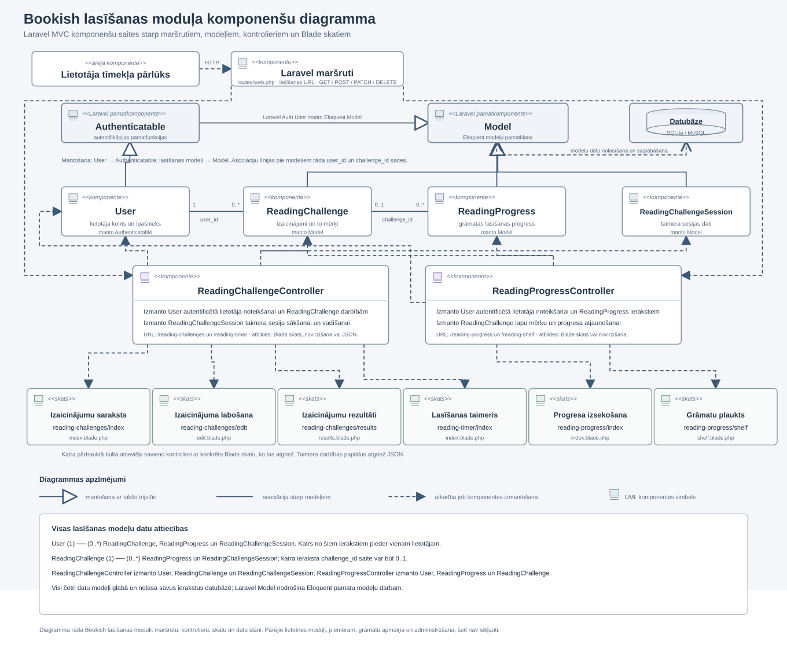

# 4. Sistēmas modelēšana un projektēšana

## 4.1. Sistēmas struktūras modelis

Sistēmas struktūras modelis attēlo sistēmas galvenos elementus, to uzbūvi un savstarpējās attiecības. Tas palīdz pārskatāmi parādīt, no kādām daļām sistēma sastāv un kā tās sadarbojas.

Šajā darbā sistēmas struktūras modelis tiek veidots tīmekļa lietotnei Bookish. Viena no tās galvenajām daļām ir datubāze, kurā glabājas lietotnes darbībai nepieciešamie dati. Datubāzes struktūru attēlo entitāšu relāciju diagramma, kurā parādītas galvenās tabulas, to lauki, primārās un ārējās atslēgas un savstarpējās attiecības. Diagrammu papildina datu vārdnīca, kurā skaidrota tabulu un lauku nozīme.

Sistēmas loģisko uzbūvi papildina klašu diagramma un komponenšu diagramma. Klašu diagramma attēlo lasīšanas funkcionalitātes klases, to atribūtus, metodes, mantošanu un savstarpējās asociācijas. Komponenšu diagramma attēlo lietotnes MVC daļas, piemēram, modeļus, kontrolierus un skatus, un parāda, kā tās ir savstarpēji saistītas. Kopā šīs diagrammas raksturo gan datu glabāšanas struktūru, gan lietotnes galvenās loģiskās daļas.

## 4.1.2. Aizmugursistēmas klašu diagramma

Klašu diagramma ir UML struktūras diagramma. Tā parāda sistēmas klases, katras klases datus un darbības, kā arī to, vai klases manto cita no citas, ir savstarpēji saistītas vai izmanto cita citu. Tādējādi diagramma paskaidro sistēmas uzbūvi, nevis darbību secību laikā.

Kā redzams 9. attēlā, diagrammā ir divas pamatdaļas. Augšdaļā parādītas lietotāja un lasīšanas datu modeļu klases ar to mantošanas un datu attiecībām. Apakšdaļā parādīti kontrolieri, kuri izmanto attiecīgos modeļus, lai apstrādātu lietotāja pieprasījumus.

**9. attēls. Klašu diagramma, kas attēlo lietotāja un lasīšanas funkcionalitātes klašu mantošanu un savstarpējās asociācijas, kā arī kontrolieru atkarību no modeļiem (saite uz diagrammu)**

### Klašu attēlojums

Katrs taisnstūris attēlo vienu klasi. Taisnstūra augšējā daļā ir klases nosaukums, vidējā daļā ir atribūti, kas raksturo klasē glabātos datus, bet apakšējā daļā ir metodes, kas apraksta klases darbības. Piemēram, ReadingChallenge atribūti raksturo izaicinājuma nosaukumu, mērķi, norises periodu un pabeigšanas informāciju, bet tā metodes apraksta saistīto datu izgūšanu un izaicinājuma pabeigšanas atjaunošanu.

Zīme plus pirms atribūta vai metodes apzīmē publisku klases locekli, bet restīte apzīmē aizsargātu klases locekli. Pēc kola norādīts atribūta vai metodes atgrieztās vērtības tips. Piemēram, Integer apzīmē veselu skaitli, String apzīmē tekstu, Date apzīmē datumu, DateTime apzīmē datumu un laiku, bet View, RedirectResponse un JsonResponse apzīmē kontroliera atgrieztās atbildes veidus.

### Mantošana

User manto Authenticatable. Diagrammā to rāda nepārtraukta līnija ar tukšu trijstūri, kas vērsts uz Authenticatable. Tas nozīmē, ka User saņem autentifikācijas pamatfunkcionalitāti, piemēram, lietotāja identifikatora un paroles izgūšanu. User klasē papildus ir lietotāja identifikators, vārds, e-pasta adrese un loma, kā arī metode, kas nosaka, vai lietotājam ir administratora tiesības.

ReadingChallenge, ReadingProgress un ReadingChallengeSession manto Model. Diagrammā to parāda līnijas no šīm trim klasēm uz kopīgo Model klasi un tukšais trijstūris pie Model. Tātad šīs klases ir atsevišķi datu modeļi, bet tām ir kopīgs Laravel modeļa pamats. Model diagrammā ir parādīti izveides un atjaunināšanas laika atribūti.

### Modeļu savstarpējās attiecības

User un ReadingChallenge savieno nepārtraukta asociācijas līnija. Pie User norādīts viens, bet pie ReadingChallenge norādīts nulle vai vairāki. Tas nozīmē, ka katrs izaicinājums ir saistīts ar vienu lietotāju, savukārt vienam lietotājam var būt vairāki izaicinājumi vai arī to var nebūt. Šo saiti atbalsta ReadingChallenge atribūts user_id un metode user().

ReadingChallenge un ReadingProgress arī ir savienoti ar asociācijas līniju. Pie ReadingChallenge norādīts viens, bet pie ReadingProgress norādīts nulle vai viens. Tas nozīmē, ka katrs progresa ieraksts ir saistīts ar vienu izaicinājumu, savukārt izaicinājumam var būt viens progresa ieraksts vai arī tā var nebūt. ReadingProgress atribūts challenge_id un metode challenge() norāda uz šo saiti.

ReadingChallengeSession ir saistīts ar lietotāju un izaicinājumu. To parāda sesijas atribūti user_id un challenge_id, kā arī metodes user() un challenge(). Vienam lietotājam var būt vairākas lasīšanas sesijas, un katra sesija ir saistīta ar vienu lietotāju. Vienam izaicinājumam var būt vairākas sesijas, un katra sesija ir saistīta ar vienu izaicinājumu.

ReadingProgress ir saistīts ar lietotāju un izaicinājumu. To parāda atribūti user_id un challenge_id, kā arī metodes user() un challenge(). Vienam lietotājam var būt vairāki progresa ieraksti, un katrs ieraksts ir saistīts ar vienu lietotāju. Katrs progresa ieraksts ir saistīts ar vienu izaicinājumu.

### Kontrolieru atkarības

ReadingChallengeController ir atkarīgs no ReadingChallenge klases. Pārtrauktā bulta uz ReadingChallenge rāda, ka kontrolieris izmanto šo modeli, lai attēlotu, izveidotu, atjauninātu un dzēstu izaicinājumus. Kontroliera metodes arī nodrošina taimera sesiju sākšanu, apturēšanu, turpināšanu, pabeigšanu un dzēšanu.

ReadingProgressController ir atkarīgs no ReadingProgress klases. Tas izmanto šo klasi, lai parādītu grāmatu plauktu un progresa informāciju, saglabātu progresa ierakstus un dzēstu tos.

Pārtrauktās bultas no kontrolieriem uz modeļiem attēlo šo atkarību. Kontrolieru metožu atgrieztie tipi norāda, kādu atbildi saņem pieprasījums. Atkarībā no darbības kontrolieri atgriež skatu, novirzīšanas atbildi vai JSON atbildi.

### Kopsavilkums

User manto Authenticatable, bet ReadingChallenge, ReadingProgress un ReadingChallengeSession manto Model. Lietotājs ir saistīts ar lasīšanas izaicinājumiem, savukārt progresa ieraksti un taimera sesijas ir saistītas ar lietotāju un izaicinājumu. ReadingChallengeController ir atkarīgs no izaicinājumu un taimera sesiju modeļiem, bet ReadingProgressController ir atkarīgs no progresa modeļa. Šīs attiecības parāda, kā klases sadarbojas lasīšanas funkcionalitātē.

## 4.1.3. MVC komponenšu diagramma

Komponenšu diagramma parāda, kā modeļi, kontrolieri un skati ir sakārtoti lasīšanas funkcionalitātē. Kā redzams 10. attēlā, tīmekļa pārlūka pieprasījumi caur Laravel maršrutiem nonāk pie attiecīgā kontrollera. Kontrolleri izmanto lasīšanas modeļus un atgriež atbilstošos Blade skatus, novirzīšanas vai JSON atbildes. Diagrammā parādīta arī modeļu mantošana, datu attiecības un saite ar datubāzi. Apakšējā skaidrojumā apkopotas visas modeļu attiecības un to kardinalitāte, lai būtu redzamas arī saites, kuras modeļu izkārtojuma dēļ nav vilktas kā atsevišķas līnijas pāri diagrammai.

**10. attēls. Bookish lasīšanas funkcionalitātes komponenšu diagramma**

10. attēlā redzamā diagramma parāda lasīšanas moduļa galvenās komponentes un to savienojumus. Nepārtrauktās līnijas ar tukšu trijstūri norāda uz mantošanu, nepārtrauktās asociāciju līnijas savieno modeļus, bet pārtrauktās bultas parāda maršrutu, kontrolieru un skatu atkarības. Diagrammas apakšā ir uzskaitītas visas modeļu datu attiecības, to kardinalitāte un datubāzes izmantošana. Tādējādi ir pārskatāma visa lasīšanas funkcionalitātes plūsma no lietotāja pieprasījuma līdz datu apstrādei un atbildei.
